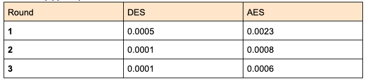

# Comparison of DES and AES algorithms
This project was done for a course on IT security.

### Encryption algorithms:
DES and AES are symmetric block ciphers. This means they use the same key for encryption and decryption, and also that they encrypt blocks rather than individual bits. In both algorithms, the plaintext message is first divided into fixed-size blocks—64 bits for DES and 128 bits for AES—and padded if necessary to fit the block size. The encryption process then transforms each block using a series of substitution and permutation operations controlled by the key. After encryption, the resulting ciphertext blocks can be decrypted using the same key to recover the original message.

### Time in s (approx.):

As can be seen from the table, the DES encryption is 4-8 times faster than the AES. This difference, although seemingly big, can be neglected in practice since the times for each algorithm are so small.

### Correctness:
Both encryption methods produce a valid output in forms of ciphertext, and both algorithms correctly decrypt the message back into plaintext.

### Security:
AES significantly outperforms DES when it comes to security. The 8-byte DES key is 64 bits, but only 56 of these are used for the key, and the other 8 for parity. The 56-bit DES key can be brute-forced and is therefore not used any longer. 
The AES key on the other hand is 128-bits and therefore much more secure. The keys in AES can be even bigger (192 or 256 bit).
In AES, the number of rounds of encryption is determined by the key length, whereas in DES it is always 16 rounds.
